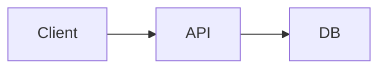

# docs-mcp

Create documents with Claude. An MCP server gives Claude full document/asset
CRUD, and a companion web app lets you edit, preview, and share the results
with **view-only links**.

## Features

- **Document CRUD** — create, list, read, update, delete (via MCP tools, REST API, or the web editor)
- **Asset CRUD** — upload images/files and embed them in documents (``)
- **Markdown** — documents are markdown, rendered live in the editor preview and on share pages
- **Mermaid diagrams** — fenced ` ```mermaid ` blocks render as diagrams
- **Excalidraw** — fenced ` ```excalidraw ` blocks containing a scene JSON render as hand-drawn SVG
- **View-only sharing** — mint unguessable share links (`/s/<token>`); viewers get a rendered, read-only page and can be revoked at any time
- **Self-contained** — SQLite storage (built-in `node:sqlite`, no native deps) and locally vendored renderer libraries; no CDN or external services needed

## Quick start

Requires Node.js >= 22.13.

```bash
npm install
npm run web        # web app on http://localhost:4680
```

Open http://localhost:4680 for the editor: document list on the left, markdown
editor in the middle, live preview on the right. Upload assets from the
sidebar and click **Insert** to drop a markdown reference at the cursor.
**Share view-only** creates a link anyone can open to read (but not edit) the
document.

## Hook it up to Claude

Register the MCP server with Claude Code:

```bash
claude mcp add docs -- node /path/to/docs-mcp/src/mcp-server.js
```

Or add it to your MCP client config manually:

```json
{
  "mcpServers": {
    "docs": {
      "command": "node",
      "args": ["/path/to/docs-mcp/src/mcp-server.js"]
    }
  }
}
```

Keep `npm run web` running in another terminal; both processes share the same
SQLite database, so documents Claude creates appear in the editor immediately.

Then ask Claude things like:

> Create a design doc for our payments service with an architecture diagram
> (mermaid) and share it with the team as view-only.

### MCP tools

| Tool | Purpose |
| --- | --- |
| `create_document` / `get_document` / `list_documents` / `update_document` / `delete_document` | Document CRUD |
| `upload_asset` / `list_assets` / `delete_asset` | Asset CRUD (base64 upload) |
| `share_document` / `list_shares` / `revoke_share` | View-only share links |

## Document format

Documents are plain markdown with two special fenced blocks:

````markdown
# My design doc



```excalidraw
{"elements": [ ... excalidraw elements ... ], "appState": {}, "files": {}}
```


````

The Excalidraw block is a standard scene export (the same JSON you get from
Excalidraw's *Save to file*, or that Claude can author directly).

## REST API

| Method & path | Purpose |
| --- | --- |
| `GET/POST /api/documents`, `GET/PUT/DELETE /api/documents/:id` | Document CRUD |
| `GET/POST /api/assets`, `DELETE /api/assets/:id`, `GET /a/:id` | Asset CRUD + binary serving |
| `POST /api/documents/:id/share`, `GET /api/documents/:id/shares`, `DELETE /api/shares/:token` | Manage share links |
| `GET /s/:token`, `GET /api/share/:token` | View-only share page + its read-only data endpoint |

## Configuration

| Env var | Default | Meaning |
| --- | --- | --- |
| `PORT` | `4680` | Web server port |
| `DOCS_MCP_URL` | `http://localhost:4680` | Public base URL used when generating share/editor links |
| `DOCS_MCP_DATA` | `./data` | Directory for the SQLite database |

## Security notes

- Share tokens are 160-bit random values; a link is view-only because the
  share endpoints expose no document ids and no write operations. Revoking a
  token disables it immediately.
- The editor and REST API have **no authentication** — run them locally or
  behind your own auth proxy if you deploy this anywhere shared.
- Markdown is rendered without sanitization (documents are authored by you or
  your Claude). Add a sanitizer (e.g. DOMPurify) before accepting untrusted
  documents.

## Project layout

```
src/db.js          # SQLite data layer shared by both servers
src/mcp-server.js  # MCP server (stdio) for Claude
src/web-server.js  # Express app: editor, REST API, share pages, vendored libs
public/            # editor UI, share page, shared renderer (marked + mermaid + excalidraw)
```
